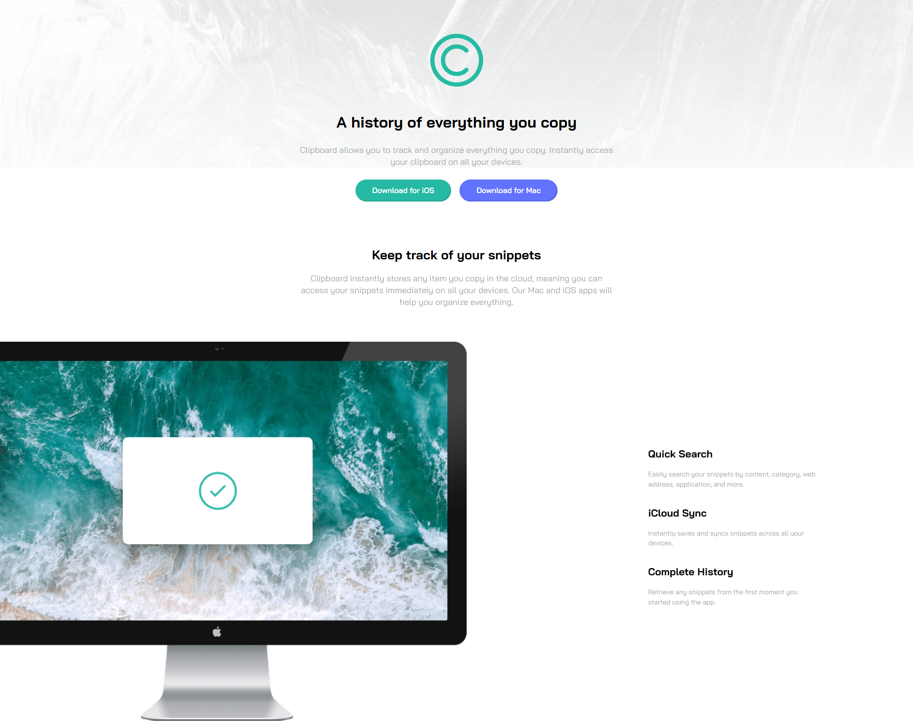

# Frontend Mentor - Clipboard landing page solution
This is a solution to the [Clipboard landing page challenge on Frontend Mentor](https://www.frontendmentor.io/challenges/clipboard-landing-page-5cc9bccd6c4c91111378ecb9).

## Table of contents

- [Overview](#overview)
  - [The challenge](#the-challenge)
  - [Screenshot](#screenshot)
  - [Links](#links)
- [My process](#my-process)
  - [Built with](#built-with)
  - [What I learned](#what-i-learned)
  - [Continued development](#continued-development)
  - [Useful resources](#useful-resources)
- [Author](#author)


## Overview
### The challenge

Users should be able to:
- View the optimal layout for the site depending on their device's screen size
- See hover states for all interactive elements on the page

### Screenshot



### Links
- Solution URL: [https://github.com/jslcoding/Clipboard_landing_page](https://github.com/jslcoding/Clipboard_landing_page)
- Live Site URL: [Add live site URL here](https://your-live-site-url.com)

## My process

### Built with
- Semantic HTML5 markup
- CSS custom properties
- Flexbox
- CSS Grid + Flex
- Mobile-first workflow
- TailwindCSS


### What I learned
Customization of the theme on the configuration file of tailwind.
```js
  theme: {
    extend: {
      backgroundImage: {
        'hero-desktop':'url("../images/bg-header-desktop.png")',
        'hero-small':'url("../images/bg-header-mobile.png")',
      },
      fontFamily:{
        'bai':'"Bai Jamjuree", sans-serif'
      },
      boxShadow:{
        'btn':'rgba(0,0,0,.15) -2px -2px 0px 0px inset'
      }
    },
    colors:{
      'cyan':'hsl(171, 66%, 44%)',
      'blue':'hsl(233, 100%, 69%)',
      'gray':'hsl(210, 10%, 33%)',
      'grayblue':'hsl(201, 11%, 66%)',
      'white':'hsl(360,100%,100%)',
      'lgray':'hsl(0,0%,96%)',
    },
  }
```

### Continued development
Possibly building inner pages and creating a theme and onload effects with a js library.

### Useful resources
- [TailwindCSS Docs](https://tailwindcss.com/docs/installation)

## Author
@jslcodig - jessica sanmartin limes
